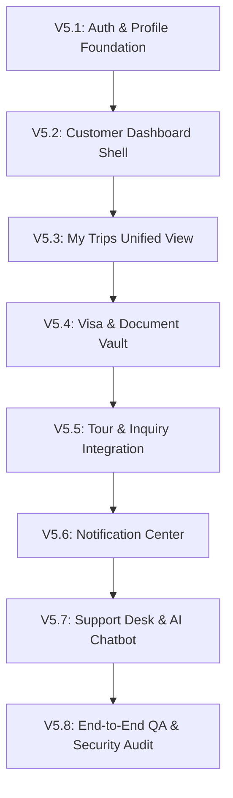

# JMT TRAVELS — V5.0 CUSTOMER EXPERIENCE FOUNDATION
## IMPLEMENTATION PLAN: CUSTOMER PORTAL / MY TRIPS (PHASES V5.1 – V5.8)

**Target Platform:** JMT TRAVELS (Oman) — Authenticated Customer Portal  
**Branch:** `v5.0-customer-experience`  
**Base Commit (main):** `fda1842e03232c59da9d1cdb34748c59dfe5ba4e`  
**Document Status:** Ready for Step-by-Step Execution  

---

## EXECUTIVE SUMMARY & ARCHITECTURAL BOUNDARIES

The objective of V5.0 is to deliver a world-class, luxury-branded, mobile-first authenticated **Customer Portal ("JMT My Trips")** using **REAL existing JMT data**.

### Strict Operational Constraints:
1. **Zero Fake Data:** Never fabricate fake booking or visa records. Empty states must provide purposeful, conversion-oriented calls to action.
2. **Payment Gateways On Hold:** PayTabs and Thawani live integration remain on hold. The portal will display read-only transaction history if available. No live payment flows will be activated.
3. **Preserve Hotels & Flights:** Preserve existing hotel and flight catalogue/enquiry architectures. Inquiries are surfaced as customer consultation requests (`ContactInquiry` / WhatsApp Desk).
4. **Preserve V3.2 AI Chatbot:** The AI Assistant remains intact and will be seamlessly accessible from the portal via contextual help triggers.
5. **Preserve Admin Operations:** No administrative breaking changes. Customer portal and admin consoles share identical data ownership rules.
6. **Strict IDOR Isolation:** All customer endpoints derive identity strictly from authenticated JWT context (`req.user.id`).

---

## PHASE BREAKDOWN (V5.1 – V5.8)

---

## PHASE V5.1: AUTHENTICATION & PROFILE FOUNDATION

### 1. Objectives
- Establish customer profile self-service APIs for `CustomerProfile`.
- Implement secure profile retrieval and update endpoints with strict input validation.
- Implement data masking for sensitive identity fields (passport number).

### 2. Backend Implementation
- **New Route:** `GET /api/account/profile`
  - *Auth:* Mandatory `authenticate` middleware.
  - *Logic:* Fetches `User` and `CustomerProfile.findOne({ userId: req.user.id })`. If profile doesn't exist, initializes an empty profile record.
  - *Data Returned:* User info (`name`, `email`, `phone`, `preferredLanguage`, `preferredCurrency`) + Profile (`passportNumberMasked`, `nationality`, `dateOfBirth`, `address`, `city`, `country`).
- **New Route:** `PUT /api/account/profile`
  - *Auth:* Mandatory `authenticate` middleware.
  - *Allowed Updates:* `name`, `phone`, `passportNumber`, `nationality`, `dateOfBirth`, `address`, `city`, `country`.
  - *Validation:* Strict length checks, date format checks, passport format checks. Ignores any client-supplied `userId`, `role`, or `status`.
- **Security Check:** Verify that User A cannot read or mutate User B's profile.

### 3. Frontend Implementation
- Build profile editor sub-view in `/account?tab=profile`.
- Display masked passport preview (`••••••1234`) with "Edit" toggle.
- Provide language and currency switcher that binds to `/api/users/preferences`.

---

## PHASE V5.2: CUSTOMER DASHBOARD SHELL & ARCHITECTURE

### 1. Objectives
- Replace the legacy table-only `/account` view in `frontend/public/assets/js/app.js` with a modular, responsive dashboard shell.
- Implement responsive navigation supporting mobile (bottom/drawer tabs) and desktop (luxury sidebar rail).
- Display overview metrics and action-required alert banners.

### 2. UX & Layout Architecture
- **Header:** JMT branding, customer avatar/greeting, verification status badge, notification bell with unread counter, language/currency indicator.
- **Navigation Tabs:**
  - `Overview`
  - `My Trips`
  - `Visa Applications`
  - `Tour Bookings`
  - `Hotel & Flight Inquiries`
  - `Documents Vault`
  - `Payments`
  - `Notifications`
  - `Help Desk`
  - `Profile`
- **Overview Widgets:**
  - *Upcoming Trip Spotlight:* Highlight the next journey departing within 30 days.
  - *Action Required Callout:* Visual alert if a visa requires additional documents or a booking has pending payment.
  - *Quick Status Counters:* Active Trips, Pending Visas, Open Tickets, Unread Alerts.
  - *Quick Action Launcher:* Buttons to "Apply for Visa", "Explore Tours", "Inquire Hotel", "Find Flights", "Chat with JMT".

### 3. Empty State Handling
- Clean, inspiring empty state when no active bookings or applications exist, with conversion CTAs linking to `/tourism` and `/visa`.

---

## PHASE V5.3: "MY TRIPS" UNIFIED EXPERIENCE

### 1. Objectives
- Provide a unified, aggregated view of the customer's journeys without altering underlying database collections.
- Allow filtering by trip state: `All Trips`, `Upcoming`, `Ongoing`, `Completed`.

### 2. Architecture & Data Aggregation
- **Trip Synthesizer Function:** Client-side aggregator that correlates:
  - `TourBooking` records (`travelDate`, `packageTitle`, `amount`, `status`)
  - `VisaApplication` records (`destination`, `visaType`, `travelDate`, `status`)
  - `ContactInquiry` records (`destination`, `dates`, inquiry details)
- **Trip Card Component:**
  - Destination hero banner (optimized WebP image)
  - Travel dates badge & countdown (e.g. "Departing in 12 days")
  - Service breakdown tags (Tour, Visa, Inquiry)
  - Overall status pill (`Confirmed`, `In Progress`, `Action Required`, `Completed`)
  - Action buttons: "View Trip Details", "Download Documents", "Need Help with this Trip?"

### 3. Deep-Dive Trip Drawer
- Expanding modal or drawer detailing all sub-components:
  - Itinerary & tour package inclusions.
  - Travellers list with ages and masked passport numbers.
  - Linked visa application status tracker.
  - Payment summary and receipt link.

---

## PHASE V5.4: VISA APPLICATIONS & DOCUMENT VAULT

### 1. Objectives
- Provide transparent tracking of submitted visa applications.
- Display a visual application lifecycle tracker.
- Allow secure uploading of requested documents for applications in `ADDITIONAL_DOCUMENTS_REQUIRED`.
- Provide secure document management (Documents Vault).

### 2. Application Tracking Interface
- **Progress Stepper:**
  1. *Submitted* (Application received & logged)
  2. *Under Review* (Verification by JMT Visa Desk)
  3. *Processing* (Lodged with Royal Oman Police / Embassy)
  4. *Approved / Ready* (E-Visa generated)
- **Additional Document Request Alert:**
  - Clear banner indicating what document type is required and staff instructions.
  - Inline upload zone connecting to `POST /api/documents/upload`.
  - Instant transition back to `UNDER_REVIEW` upon upload.

### 3. Document Vault Component
- List all uploaded identity documents (`PASSPORT_COPY`, `PHOTO`, `CIVIL_ID`, `TRAVEL_ITINERARY`).
- Status indicators: `Uploaded`, `Under Review`, `Accepted`, `Needs Re-upload`.
- Secure preview and streaming download button via `GET /api/documents/:id/download`.
- File security reminders regarding allowed formats (PDF, JPEG, PNG, WEBP, max 10MB).

---

## PHASE V5.5: TOUR BOOKINGS & INQUIRY INTEGRATION

### 1. Objectives
- Provide detailed management for reserved holiday packages.
- Integrate Hotel and Flight consultation requests.

### 2. Tour Bookings Management
- Display booking reference, package title, destination, booked departure date.
- Breakdown of booked travellers (`BookingTraveller` records).
- Itemized pricing breakdown (`amount`, currency, unit price, tax/fees).
- Self-service cancellation request trigger (`POST /api/tourism/bookings/:id/cancel`) conforming to cancellation policies.

### 3. Hotels & Flights Inquiry Tracker
- Present customer's submitted hotel/flight inquiries (`ContactInquiry`).
- Display current travel desk status (`Specialist Reviewing`, `Proposal Ready`, `Completed`).
- One-click "Connect with Assigned Specialist on WhatsApp" button with pre-filled enquiry reference.

---

## PHASE V5.6: NOTIFICATION CENTER & IN-APP ALERTS

### 1. Objectives
- Integrate the existing in-app notification engine into the customer portal.
- Allow customers to stay updated on visa status changes, booking milestones, and travel reminders.

### 2. Features & Endpoints
- **Feed View:** Uses `GET /api/notifications?page=1&limit=20`.
- **Badging:** Header alert bell showing unread count.
- **Interactivity:**
  - Clicking an unread notification calls `PATCH /api/notifications/:id/read`.
  - "Mark All as Read" button calls `PATCH /api/notifications/read-all`.
  - Deep-linking: Clicking a notification regarding visa application `JMT-V-12345` automatically switches to the `Visa Applications` tab and highlights that application.

---

## PHASE V5.7: HELP DESK & AI CHATBOT INTEGRATION

### 1. Objectives
- Enable customers to manage support tickets directly from the portal.
- Provide contextual handoff to the JMT AI Assistant.

### 2. Support Ticket Center
- Ticket list displaying `ticketId`, subject, category, priority, status (`OPEN`, `WAITING_FOR_CUSTOMER`, `RESOLVED`).
- Conversation view showing message exchanges between customer and JMT support desk.
- Create New Ticket form calling `POST /api/support/tickets`.

### 3. Contextual Chatbot Drawer Integration
- On any trip card or visa application, provide a `"Need Help with this Trip?"` button.
- Clicking the button:
  1. Opens the floating AI assistant drawer.
  2. Injects contextual prompt (e.g. *"I have a question about my booking JMT-B-849201 to Salalah"*).
  3. Uses existing `POST /api/chat/conversations/:id/messages` endpoint with authenticated user session.

---

## PHASE V5.8: QUALITY ASSURANCE, PERFORMANCE & SECURITY VALIDATION

### 1. Comprehensive Viewport Responsiveness Audit
Verify layout integrity and usability across all 11 target viewports:
- `320px`, `360px`, `375px`, `390px`, `412px`, `430px`, `768px`, `1024px`, `1366px`, `1440px`, `1920px`.
- Verify touch targets >= 44×44px on mobile devices.
- Verify zero horizontal scrolling or layout shifts.

### 2. Security & IDOR Verification Test Suite
Add automated integration test scenarios to `backend/test_api.js`:
- `[SEC-V5-01]` User A cannot view User B's profile (`GET /api/account/profile`).
- `[SEC-V5-02]` User A cannot mutate User B's profile (`PUT /api/account/profile`).
- `[SEC-V5-03]` User A cannot list or read User B's trips, visas, or bookings.
- `[SEC-V5-04]` User A cannot download User B's uploaded passport documents.
- `[SEC-V5-05]` User A cannot read or mark User B's notifications.
- `[SEC-V5-06]` User A cannot read or reply to User B's support tickets or chat sessions.
- `[SEC-V5-07]` Unauthenticated requests to customer portal endpoints return 401.

### 3. Regression & Performance Verification
- Verify all 143 existing automated test cases continue to pass with 100% pass rate.
- Ensure all API endpoints adhere to sub-100ms response targets on indexed queries.
- Verify code hygiene via `git diff --check`.

---

## IMPLEMENTATION TIMELINE & MILESTONES

| Milestone | Scope | Deliverables | Verification Gateway |
|---|---|---|---|
| **Milestone 1** | Phase V5.1 & V5.2 | Profile APIs, Responsive Dashboard Shell | Automated profile tests, Viewport smoke test |
| **Milestone 2** | Phase V5.3 & V5.4 | My Trips Aggregator, Visa Stepper, Document Vault | Visual stepper verification, File upload/download test |
| **Milestone 3** | Phase V5.5 & V5.6 | Tour Bookings, Hotels/Flights, Notifications | Notification badge verification, Deep-linking test |
| **Milestone 4** | Phase V5.7 & V5.8 | Help Desk, Chatbot Integration, Security Matrix | 100% pass rate across test suite, 0 IDOR defects |
